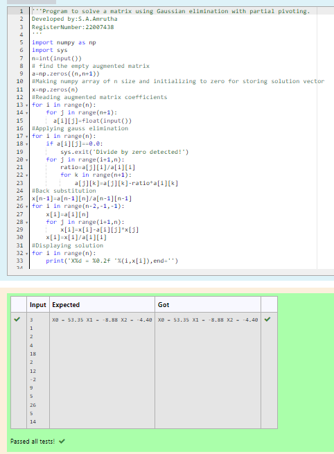

# Gaussian Elimination

## AIM:
To write a program to find the solution of a matrix using Gaussian Elimination.

## Equipments Required:
1. Hardware – PCs
2. Anaconda – Python 3.7 Installation / Moodle-Code Runner

## Algorithm
1. Get the matrix from user.

2. Using "from numpy as np sys" to import numpy (Ge).

3. Print the result matrices (Gaussian Elimination).

4. End the program.

## Program:
~~~
Program to solve a matrix using Gaussian elimination with partial pivoting.
Developed by:S.A.Amrutha 
RegisterNumber:22007438 

import numpy as np
import sys
n=int(input())
# find the empty augmented matrix
a=np.zeros((n,n+1))
#Making numpy array of n size and initializing to zero for storing solution vector
x=np.zeros(n)
#Reading augmented matrix coefficients
for i in range(n):
    for j in range(n+1):
      a[i][j]=float(input())
#Applying gauss elimination    
for i in range(n):
    if a[i][j]==0.0:
        sys.exit('Divide by zero detected!')
    for j in range(i+1,n):
        ratio=a[j][i]/a[i][i]
        for k in range(n+1):
            a[j][k]=a[j][k]-ratio*a[i][k]
#Back substitution    
x[n-1]=a[n-1][n]/a[n-1][n-1]
for i in range(n-2,-1,-1):
    x[i]=a[i][n]
    for j in range(i+1,n):
        x[i]=x[i]-a[i][j]*x[j]
    x[i]=x[i]/a[i][i]
#Displaying solution   
for i in range(n):
    print('X%d = %0.2f '%(i,x[i]),end='')
~~~  
## Output:

## Result:
Thus the program to find the solution of a matrix using Gaussian Elimination is written and verified using python programming.

